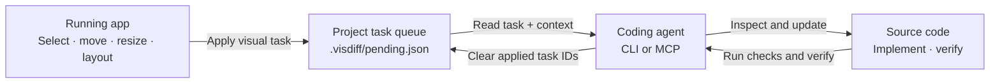

# visdiff

**Turn visual UI feedback into actionable tasks for coding agents.**

Visdiff connects a running web page to the source code behind it. Adjust an element in the browser, capture the visual change, and give the resulting task to an agent through its CLI or MCP client.

[](https://github.com/artemjasan/visdiff/actions/workflows/ci.yml)
[](https://nodejs.org/)
[](LICENSE)

> **Documentation:** explore the [Visdiff guide](https://artemjasan.github.io/visdiff/) or read its source in [`docs/`](docs/). To try the actual browser workflow, [run the local demo](#try-the-demo).

## How it works



Visdiff does **not** patch source code or make an agent guess from a screenshot alone. It captures the browser result and useful context; the agent inspects the source and chooses a maintainable implementation.

## Try the demo

Requirements: Node.js `^20.19.0 || >=22.12.0`.

From the repository root:

```bash
npm ci
npm run build
npm run demo
```

Open [http://127.0.0.1:5173](http://127.0.0.1:5173).

Framework examples are available with `npm run demo:vue` at [http://127.0.0.1:5174](http://127.0.0.1:5174) and `npm run demo:svelte` at [http://127.0.0.1:5175](http://127.0.0.1:5175). Build all three with `npm run build:examples`.

1. Click **visdiff**, then select an element.
2. Drag it, resize it, or use the arrow keys to move it. **Shift + arrow** moves it by 10 px.
3. Shift-click additional elements to create a multi-selection. If they share a parent, open **Layout** to preview Flex/Grid and alignment changes on that shared container.
4. Add an optional task note or per-change comment, then click **Apply** to enqueue the task.

Edits collect in the change panel until applied. **Reset** restores the current preview; **Esc** or **✕** cancels the selection; **Clear** discards the unsent batch. Applied preview styles remain until the app's code or HMR replaces them.

## Connect an agent

For a project using Vite, the agent can add the plugin once to the existing Vite config; no component or template annotations are needed. Then start or restart the dev server, make a visual edit in the browser, and apply it to the task queue. The agent reads the task, updates source, verifies the result, and clears only completed task IDs. See the [agent workflow](https://artemjasan.github.io/visdiff/guide/agent-workflow) and [framework/bundler support matrix](https://artemjasan.github.io/visdiff/reference/adapters).

### CLI

Run these commands from the repository root:

```bash
npm exec --workspace examples/vite-react -- visdiff tasks
npm exec --workspace examples/vite-react -- visdiff instructions
npm exec --workspace examples/vite-react -- visdiff clear <task-id> [task-id ...]
```

- `tasks` prints the full pending task JSON.
- `instructions` prints the recommended agent workflow.
- `clear <task-id...>` removes only the listed tasks. Bare `clear` clears the entire queue; use it only when that is intentional.

### MCP

The stdio server exposes two tools: `visdiff_pending_tasks` reads the queue and provides agent guidance; `visdiff_clear_tasks` removes only the supplied task IDs.

For Claude Code, run from the repository root:

```bash
claude mcp add visdiff -- npm exec --workspace examples/vite-react -- visdiff mcp
```

Other MCP clients that support local stdio can launch the same `npm exec ... visdiff mcp` command; their configuration format may differ.

## What an agent receives

Each queued task includes:

- **Intent:** optional task-level and per-edit notes.
- **Location:** page URL, viewport, source file/line when available, and a runtime selector/text description.
- **Observed result:** CSS property changes with `from` and `to` values, plus an edit kind such as `move`, `resize`, or `style`.
- **Relationships:** changes from one multi-selection share a `selectionGroups.id`; `member` identifies selected elements and `layout-container` identifies their shared parent.

The CSS values describe what happened in the browser, not necessarily how the source should be written. Agents should inspect the relevant component and styles, implement the smallest maintainable change, run relevant checks, verify the result where possible, and clear only tasks they successfully applied. Ambiguous or unverified tasks should remain pending.

## Framework and bundler support

The Vite adapter injects the overlay and local task endpoint during development. Register `visdiffVite()` before the framework plugin:

```ts
import { defineConfig } from 'vite'
import react from '@vitejs/plugin-react'
import { visdiffVite } from 'visdiff/vite'

export default defineConfig({
  plugins: [visdiffVite(), react()],
})
```

Vite source anchors cover React JSX/TSX, Vue 3 SFC templates, and Svelte 4/5 markup. Register Visdiff before the framework plugin. Vue and Svelte elements created at runtime may not map to a template source location.

Generic adapters are available from `visdiff/rollup`, `visdiff/webpack`, `visdiff/rspack`, `visdiff/rsbuild`, `visdiff/rolldown`, `visdiff/esbuild`, `visdiff/farm`, and `visdiff/bun`. They do not inject HTML: add a development-only script tag using the endpoint URL printed at startup. React JSX/TSX source anchors are available through the generic source transform; Vue/Svelte anchors are currently Vite-only. See the [support matrix](https://artemjasan.github.io/visdiff/reference/adapters) for details. Adapters and source instrumentation are development-only. Turbopack is not supported.

Install the plugin with `npm install -D visdiff` and run its CLI with `npx -y visdiff <command>`.

## Development

```bash
npm run check
npm run build
npm run docs:build
npm run demo
```

`npm run check` runs ESLint, TypeScript checks for the package and demo, and the package tests. CI runs these checks and the build on supported Node.js versions.

## Repository map

- `packages/visdiff/src/client/` — browser selection, editing, layout, batch state, and geometry.
- `packages/visdiff/src/client/overlay.ts` — browser overlay UI.
- `packages/visdiff/src/source-inject.ts` — development-time source locations for JSX/TSX, Vue SFC templates, and Svelte markup.
- `packages/visdiff/src/vite-plugin.ts` and `plugin.ts` — Vite and other bundler adapters.
- `packages/visdiff/src/cli.ts` and `mcp.ts` — CLI and MCP agent interfaces.
- `packages/visdiff/src/queue.ts` — validated, atomic task-queue operations.
- `packages/visdiff/test/` — task-contract and queue tests.
- `examples/vite-react/` — runnable demo application.

## License

MIT. See [LICENSE](LICENSE).
