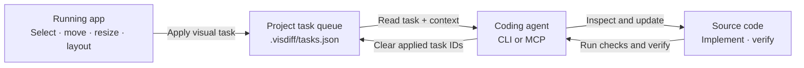

# visdiff

**Give your coding agent visual feedback on your app.**

Visdiff connects a running web page to the source code behind it. Adjust an element in the browser, capture the visual change, and give the resulting task to an agent through its CLI or MCP client.

[](https://github.com/artemjasan/visdiff/actions/workflows/ci.yml)
[](https://nodejs.org/)
[](LICENSE)

> **Documentation:** explore the [Visdiff guide](https://artemjasan.github.io/visdiff/) or read its source in [`docs/`](docs/).

## How it works



Visdiff does **not** patch source code or make an agent guess from a screenshot alone. It captures the browser result and useful context; the agent inspects the source and chooses a maintainable implementation.

## Quick start with Vite

Requirements: Node.js `^20.19.0 || >=22.12.0`.

```bash
npm install -D visdiff
```

Register the plugin before your framework plugin in the existing Vite configuration:

```ts
import { defineConfig } from 'vite'
import react from '@vitejs/plugin-react'
import { visdiffVite } from 'visdiff/vite'

export default defineConfig({
  plugins: [visdiffVite(), react()],
})
```

Start your development server, open the app, and click **visdiff** to make and apply a visual task.

1. Click **visdiff**, then select an element.
2. Drag it, resize it, or use the arrow keys to move it. **Shift + arrow** moves it by 10 px.
3. Shift-click additional elements to create a multi-selection. If they share a parent, open **Layout** to preview Flex/Grid and alignment changes on that shared container.
4. Add an optional task note or per-change comment, then click **Apply** to enqueue the task.

Edits collect in the change panel until applied. **Reset** restores the current preview; **Esc** or **✕** cancels the selection; **Clear** discards the unsent batch. Applied preview styles remain until the app's code or HMR replaces them.

## Connect an agent

Run from the project root to read tasks and agent instructions:

```bash
npx -y visdiff tasks
npx -y visdiff instructions
```

Clear only the task IDs the agent implemented and verified:

```bash
npx -y visdiff clear <task-id> [task-id ...]
```

Or connect through MCP. For Claude Code:

```bash
claude mcp add visdiff -- npx -y visdiff mcp
```

Other MCP clients can launch `npx -y visdiff mcp` over local stdio. See the [agent workflow](https://artemjasan.github.io/visdiff/guide/agent-workflow) for implementation and verification rules.

## Framework and bundler support

Vite provides the integrated overlay, endpoint, and source anchors for React, Vue, and Svelte. Generic adapters are available for other bundlers and require a manual client script. See the [support matrix](https://artemjasan.github.io/visdiff/reference/adapters) for details. Integrations run in development; Turbopack is not supported.

## Development

```bash
npm run check
npm run build
npm run docs:build
```

`npm run check` runs ESLint, TypeScript checks, and package tests. CI runs these checks and the package and documentation builds on supported Node.js versions.

## Repository map

- `packages/visdiff/src/client/` — browser selection, editing, layout, batch state, and geometry.
- `packages/visdiff/src/client/overlay.ts` — browser overlay UI.
- `packages/visdiff/src/source-inject.ts` — development-time source locations for JSX/TSX, Vue SFC templates, and Svelte markup.
- `packages/visdiff/src/vite-plugin.ts` and `plugin.ts` — Vite and other bundler adapters.
- `packages/visdiff/src/cli.ts` and `mcp.ts` — CLI and MCP agent interfaces.
- `packages/visdiff/src/queue.ts` — validated, atomic task-queue operations.
- `packages/visdiff/test/` — task-contract and queue tests.
## License

MIT. See [LICENSE](LICENSE).
